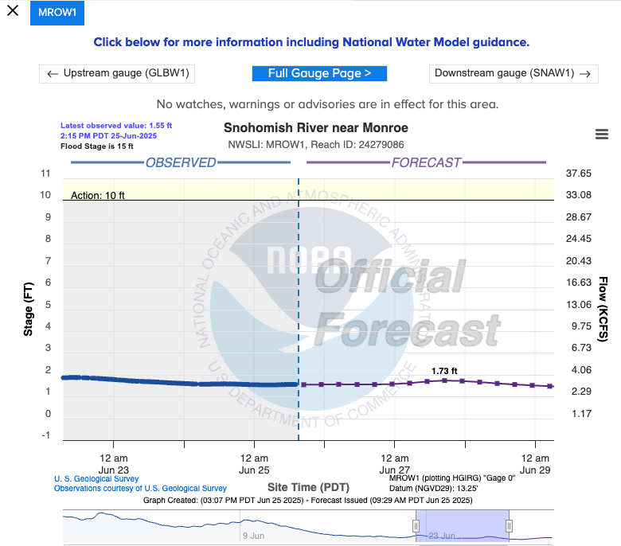
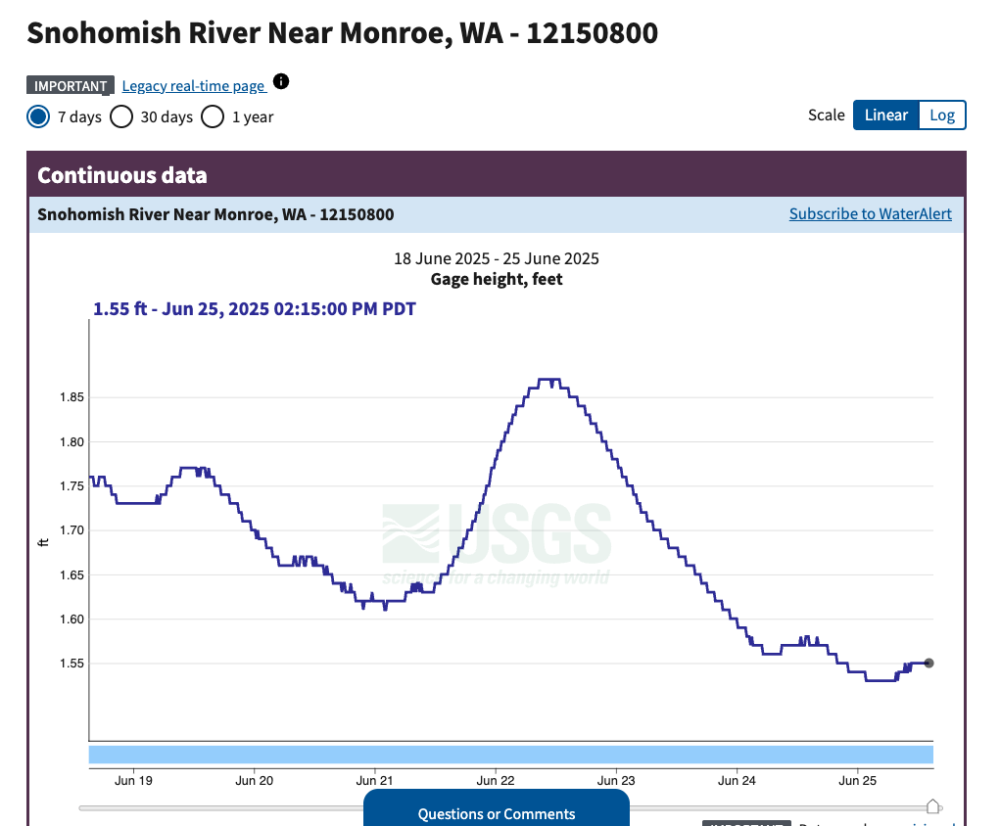

[//]: # (This file will document the key concepts I'm learning, the data sources I find, questions that arise, and daily progress notes)

### June 25th, 2025
Selected pilot location: Snohomish River at Monroe

Available data: 

Set up `requirements.txt` and overall repo structure.
Set up conda virtual environment as well.
